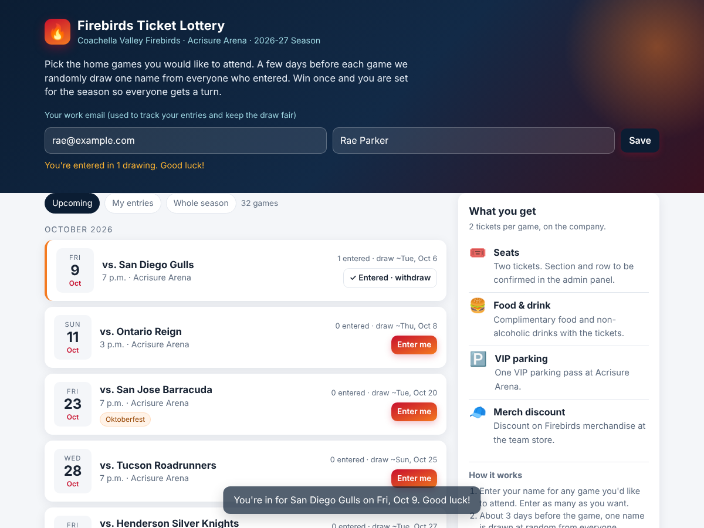
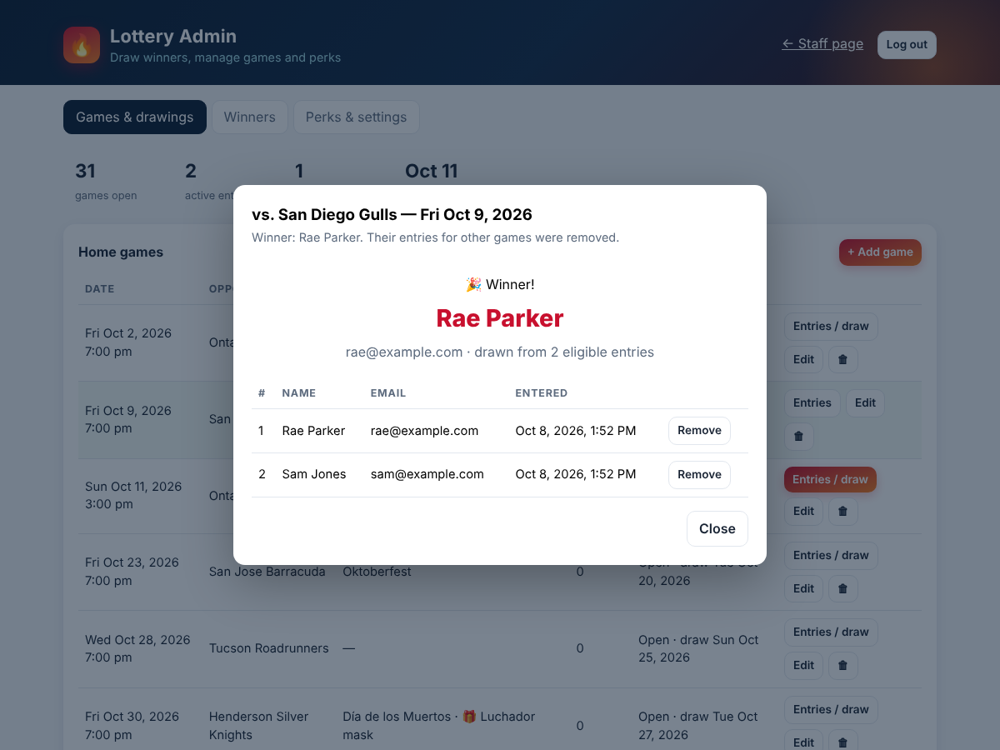

# Firebirds Ticket Lottery

A small internal web app for giving away company tickets to Coachella Valley Firebirds home games.

- Staff see the season's home schedule at Acrisure Arena with theme nights and giveaways.
- They enter their name and work email for any games they'd like to attend.
- A few days before each game an admin draws one winner at random from everyone entered.
- Once someone wins, they are blocked from every other drawing that season and their other entries are removed, so everyone gets a turn.
- The perks that come with the tickets (seats, food, VIP parking, merch discount, and so on) are shown on the page and editable by the admin.





## Run it

Requires Node 22.13 or newer (it uses the built-in SQLite module, so there are no native dependencies).

```bash
cd firebirds-tickets
npm install
ADMIN_PASSWORD=choose-a-password npm start
```

Open http://localhost:3000 for the staff page and http://localhost:3000/admin for the admin panel.

Copy `.env.example` to see all settings. The important ones:

| Variable | Purpose |
| --- | --- |
| `ADMIN_PASSWORD` | Required. Password for the admin panel. |
| `SESSION_SECRET` | Optional. Signs the admin cookie. Set it so admins stay logged in across restarts. |
| `DB_PATH` | Optional. SQLite file location, default `./data/firebirds.db`. |
| `PORT` | Optional. Default 3000. |
| `SECURE_COOKIES` | Set to `1` when serving over HTTPS. |

The database and seed schedule are created automatically on first start.

### Docker

```bash
docker build -t firebirds-tickets .
docker run -p 3000:3000 -v firebirds-data:/data -e ADMIN_PASSWORD=choose-a-password firebirds-tickets
```

Any host that runs a Node or Docker service with a persistent disk works (Render, Railway, Fly.io, an internal VM). Mount persistent storage at the database path or entries are lost on redeploy.

### Tests

```bash
npm test
```

## How the drawing works

1. Staff enter games from the main page. One entry per email per game. Entries close automatically at puck drop, or earlier if an admin unticks "Accepting entries" on a game.
2. The admin opens the game in the admin panel and clicks **Draw winner**. The server picks uniformly at random (using `crypto.randomInt`) from entrants who have not already won this season.
3. The winner's name is shown on the public schedule. Their entries for other games are deleted and any new entry attempts are refused with a message explaining why.
4. If a winner can't go, **Undo draw** on the Winners tab removes the win and makes them eligible again. Their deleted entries are not restored, so they will need to re-enter.
5. **Reset season** on the settings tab wipes every entry and winner. Games and perks are kept.

The "draw lead time" setting only controls the expected draw date shown to staff and the "Ready to draw" flag in the admin panel. Drawings are always triggered by an admin, never automatically.

## Schedule data

The seed schedule in `src/seed.js` is the 2026-27 home schedule compiled from the team's press releases as reported by KESQ, NBC Palm Springs, Patch, OurSports Central and Acrisure Arena listings. The team site itself could not be fetched from the build environment, so **verify against [cvfirebirds.com](https://cvfirebirds.com/schedule/2026-27-schedule/) before relying on it**.

Known gaps:

- The team announced 36 home games. 33 are seeded. The missing three are most likely in February through April 2027.
- Dates marked with a note in the app (Tucson in February, Bakersfield on Lakers Night, and the Sunday start times for Teddy Bear Toss and Fuego's Birthday) had conflicting reports.

All games, including dates, times, themes and giveaways, can be edited, added or deleted in the admin panel, so no code change is needed to fix the schedule.

## Project layout

```
src/server.js   entry point, reads env and starts the server
src/app.js      Express routes (public API, admin API, static files)
src/db.js       SQLite schema and first-run seeding
src/auth.js     admin password check and signed session cookie
src/time.js     Pacific-time helpers
src/seed.js     home schedule, default perks and settings
public/         staff page (index.html, app.js), admin page (admin.html, admin.js), styles.css
test/           API tests (node --test)
```

## API summary

Public:

- `GET /api/schedule` — games with status, entry counts, winner names, perks and settings.
- `GET /api/me?email=` — which games this email has entered and whether they've won.
- `POST /api/games/:id/entries` `{name, email}` — enter a drawing.
- `DELETE /api/games/:id/entries` `{email}` — withdraw.

Admin (cookie from `POST /api/admin/login {password}`):

- `GET /api/admin/overview`, `GET /api/admin/games/:id/entries`
- `POST /api/admin/games/:id/draw`, `DELETE /api/admin/games/:id/winner`
- `POST/PUT/DELETE /api/admin/games[/:id]`, `DELETE /api/admin/games/:id/entries/:entryId`
- `PUT /api/admin/settings`, `POST /api/admin/reset-season {confirm:"RESET"}`
